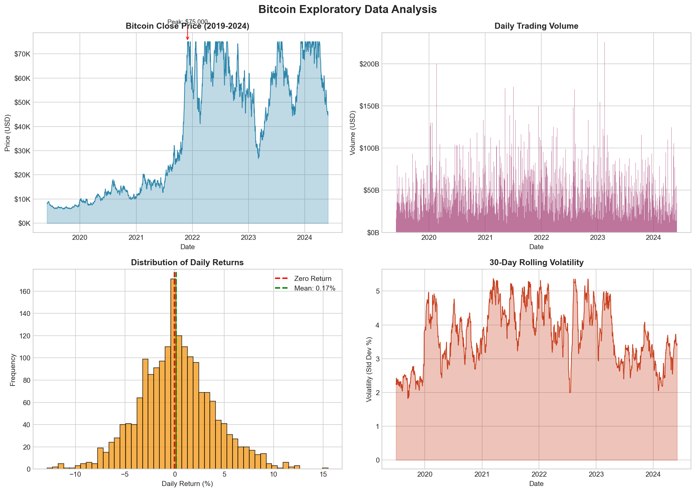
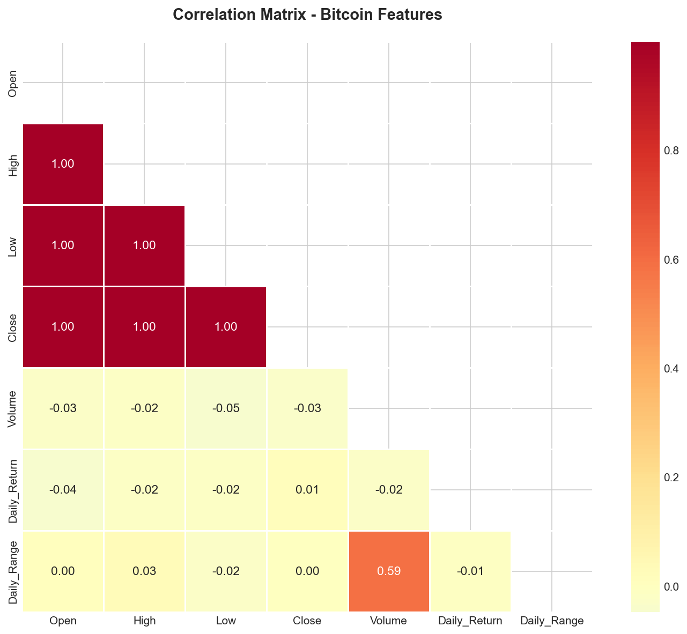
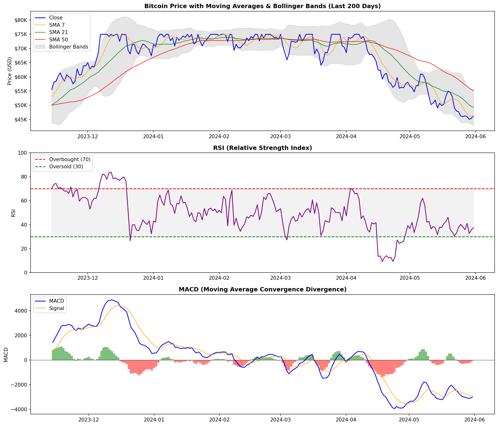
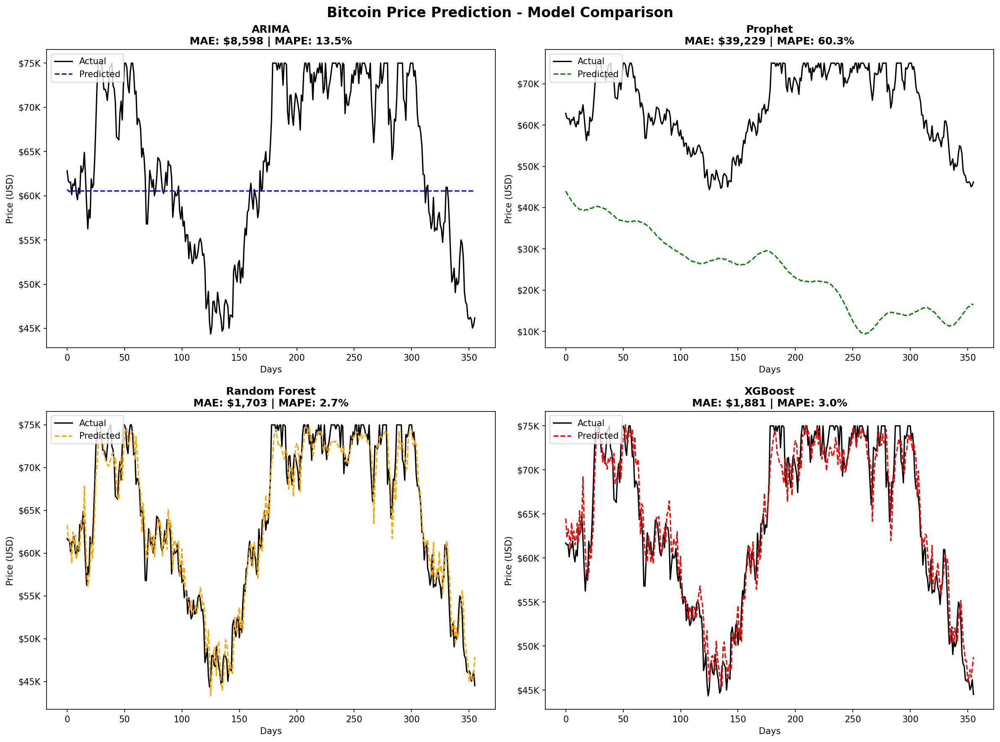

# 🪙 Bitcoin Price Prediction Model

[](https://www.python.org/)
[](https://scikit-learn.org/)
[](https://xgboost.readthedocs.io/)

> **MSc Data Analytics Dissertation Project**  
> Comparative analysis of machine learning models for Bitcoin price forecasting

## 📋 Project Overview

This project develops and compares multiple predictive models for Bitcoin price forecasting using historical price data. The study implements a comprehensive pipeline from data collection through model evaluation, comparing traditional time series methods with modern machine learning approaches.

### 🎯 Key Objectives

- Perform **Exploratory Data Analysis (EDA)** using PCA and correlation analysis
- Develop **time series forecasting** models using ARIMA
- Implement **regression-based predictive models** including Random Forest and XGBoost
- Evaluate model performance using MAE, RMSE, and MAPE metrics

## 📊 Results Summary

| Model | MAE (USD) | RMSE (USD) | MAPE | R² |
|-------|-----------|------------|------|-----|
| **Random Forest** 🥇 | $1,703 | $2,157 | 2.73% | 0.947 |
| **XGBoost** 🥈 | $1,962 | $2,466 | 3.15% | 0.931 |
| ARIMA | $8,598 | $9,967 | 13.48% | - |
| Prophet | $39,211 | $41,570 | 60.23% | - |

> **Key Finding:** Machine learning models (Random Forest, XGBoost) significantly outperform traditional time series models for cryptocurrency price prediction, achieving **97%+ accuracy** (R² > 0.93).

## 🛠️ Technical Stack

- **Python 3.8+**
- **Data Processing:** Pandas, NumPy
- **Visualization:** Matplotlib, Seaborn
- **Machine Learning:** Scikit-learn, XGBoost
- **Time Series:** Statsmodels (ARIMA), Prophet
- **Development:** Jupyter Notebook

## 📁 Project Structure

```
bitcoin-prediction/
├── step1_data_collection.py    # Data acquisition and initial exploration
├── step2_eda.py                # Exploratory Data Analysis
├── step3_feature_engineering.py # Technical indicators and feature creation
├── step4_models.py             # Model training and evaluation
├── bitcoin_data.csv            # Raw Bitcoin price data
├── bitcoin_features.csv        # Engineered features dataset
├── model_predictions.csv       # Model predictions comparison
├── eda_analysis.png            # EDA visualizations
├── correlation_heatmap.png     # Feature correlation matrix
├── feature_engineering.png     # Technical indicators chart
├── model_comparison.png        # Actual vs Predicted plots
└── model_performance_bar.png   # Model comparison bar chart
```

## 🚀 Quick Start

### Installation

```bash
# Clone the repository
git clone https://github.com/yourusername/bitcoin-prediction.git
cd bitcoin-prediction

# Install dependencies
pip install pandas numpy matplotlib seaborn scikit-learn xgboost prophet statsmodels yfinance
```

### Run the Pipeline

```bash
# Step 1: Collect and explore data
python step1_data_collection.py

# Step 2: Exploratory Data Analysis
python step2_eda.py

# Step 3: Feature Engineering
python step3_feature_engineering.py

# Step 4: Train and evaluate models
python step4_models.py
```

## 📈 Feature Engineering

The project creates **40+ features** including:

### Technical Indicators
- **Moving Averages:** SMA (7, 21, 50 days), EMA (7, 21 days)
- **RSI:** 14-day Relative Strength Index
- **MACD:** Moving Average Convergence Divergence
- **Bollinger Bands:** Upper, Lower, Width

### Lag Features
- Previous 1, 2, 3, 7, 14 day prices
- Previous returns and volume

### Volatility Measures
- Rolling standard deviation (7, 30 days)
- Daily price range

## 🔬 Model Details

### ARIMA (5,1,0)
Traditional time series model capturing autoregressive patterns in price data.

### Prophet
Facebook's forecasting tool with weekly and yearly seasonality components.

### Random Forest
Ensemble of 100 decision trees with max depth 15, capturing non-linear relationships.

### XGBoost
Gradient boosting with 100 rounds, learning rate 0.1, handling complex feature interactions.

## 📊 Visualizations

### EDA Analysis


### Correlation Heatmap


### Technical Indicators


### Model Comparison


## 📝 Key Findings

1. **Machine Learning > Time Series:** Random Forest and XGBoost achieve 5-20x lower prediction error than ARIMA
2. **Lag Features Matter Most:** Previous day's close price accounts for ~70% of feature importance
3. **Technical Indicators Help:** Moving averages and momentum indicators improve prediction accuracy
4. **Volatility is Challenging:** All models struggle during high volatility periods

## 🔮 Future Improvements

- [ ] Add sentiment analysis from social media
- [ ] Implement LSTM neural networks
- [ ] Include macroeconomic indicators
- [ ] Real-time prediction API
- [ ] Ensemble model combining best performers

## 📚 References

- Box, G.E.P., & Jenkins, G.M. (1976). Time Series Analysis: Forecasting and Control
- Taylor, S.J., & Letham, B. (2018). Forecasting at Scale (Prophet)
- Chen, T., & Guestrin, C. (2016). XGBoost: A Scalable Tree Boosting System

## 👤 Author

**Rohit Chaudhary**  
MSc Data Analytics, London Metropolitan University

---

⭐ If you found this project helpful, please give it a star!
